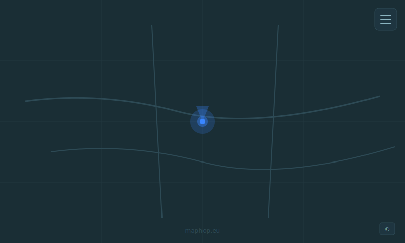

# Maphop

<p align="center">
  
</p>

<p align="center">
  A local-first, privacy-first Progressive Web App map viewer — no accounts, no tracking, all data stays on your device.
</p>

<p align="center">
  <a href="https://maphop.eu">🗺️ Live Demo</a>
</p>

---

## Table of Contents

- [What is Maphop?](#what-is-maphop)
- [Features](#features)
- [How to Use](#how-to-use)
  - [Opening the Map](#opening-the-map)
  - [Switching Map Styles](#switching-map-styles)
  - [Showing Your Location](#showing-your-location)
  - [Saving Favorites](#saving-favorites)
  - [3D Terrain](#3d-terrain)
  - [Installing as an App](#installing-as-an-app)
- [Screenshot](#screenshot)
- [For Developers](#for-developers)
  - [Prerequisites](#prerequisites)
  - [Local Development](#local-development)
  - [Running Tests](#running-tests)
  - [Building for Production](#building-for-production)
  - [Deploying](#deploying)

---

## What is Maphop?

Maphop is a lightweight map viewer you open in any modern browser. It gives you:

- **Zero setup** — visit [maphop.eu](https://maphop.eu) and the map opens instantly.
- **Complete privacy** — your saved locations live in your browser's IndexedDB only; nothing is sent to a server.
- **Offline support** — a service worker caches the app shell so it loads even without a network connection.
- **Multiple map styles** — choose from 7 tile providers covering street maps, topographic maps, cycling routes, and satellite imagery.

---

## Features

| Feature | Description |
|---------|-------------|
| 🗺️ **7 Base Maps** | Bergfex OSM, OpenStreetMap, OpenFreeMap Liberty, OpenTopoMap, CyclOSM, Esri Satellite, basemap.at Grau |
| 📍 **Live Location** | Opt-in GPS tracking with an accuracy circle and heading cone overlay |
| ⭐ **Favorites** | Save and recall named map views; stored 100% locally in IndexedDB |
| 🏔️ **3D Terrain** | Toggle hillshade and terrain exaggeration for a three-dimensional view |
| 🧭 **Compass** | Appears when the map is rotated; tap to snap back to north |
| 🔄 **Re-center** | Appears when you pan away from your live location; tap to fly back |
| 📴 **Offline-capable** | Service worker caches the app shell for use without connectivity |
| 📲 **Installable PWA** | Add to your home screen on Android or iOS for a native app feel |
| 🔒 **Privacy-first** | No accounts, no analytics, tile requests use a `no-referrer` policy |

---

## How to Use

### Opening the Map

Visit **[https://maphop.eu](https://maphop.eu)** in any modern browser. The map loads immediately — no sign-up required.

### Switching Map Styles

1. Tap the **☰ hamburger button** (top-right) to open the menu.
2. Scroll to the **Maps** section and tap any style name to switch instantly.

Available styles:

- **Bergfex OSM** — detailed street and trail map (default)
- **OpenStreetMap** — classic community-maintained street map
- **OpenFreeMap Liberty** — clean, lightweight vector map
- **OpenTopoMap** — topographic contour map, great for hiking
- **CyclOSM** — cycling-focused map with route highlights
- **Esri Satellite** — satellite imagery
- **basemap.at Grau** — greyscale Austrian base map

### Showing Your Location

1. Open the menu and expand the **Location** section.
2. Tap **Show My Location** to toggle the GPS overlay on or off.
3. Your browser will ask for location permission the first time — location data never leaves your device.

> **Privacy note:** The tile provider can infer your approximate area from the map tiles your device requests.

### Saving Favorites

1. Pan and zoom the map to the view you want to save.
2. Open the menu and expand the **Favorites** section.
3. Tap **Save Current View** — you will be prompted for a name.
4. Saved favorites appear as buttons in the list; tap any to fly back to that view.

To back up or restore your favorites, go to **Settings** (link in the menu footer) and use the JSON export/import controls.

### 3D Terrain

1. Open the menu and expand the **Location** section.
2. Tap **3D Terrain** to toggle hillshade and DEM-based exaggeration.
3. The map tilts to 45° automatically; right-click-drag (desktop) or two-finger gesture (touch) adjusts the tilt further.

### Installing as an App

**Android (Chrome):** An install banner appears at the bottom of the screen — tap **Install** to add Maphop to your home screen.

**iOS (Safari):** Tap the **Share** button then **Add to Home Screen**.

Once installed, Maphop opens in full-screen mode and works offline using cached tiles from previous sessions.

---

## Screenshot



> 💡 Visit the [live demo at maphop.eu](https://maphop.eu) to see the app in action.

---

## For Developers

### Prerequisites

- **Node.js** 20 or later
- **npm** 10 or later (bundled with Node.js 20)

### Local Development

```bash
# Clone the repository
git clone https://github.com/mdiener21/maphop.git
cd maphop

# Install dependencies
npm install

# Start the Vite dev server with hot-module replacement
npm run dev
```

Open [http://localhost:5173](http://localhost:5173) in your browser. Changes to source files in `src/` are reflected immediately without a full reload.

### Running Tests

```bash
# Run unit tests once
npm test

# Run unit tests in watch mode (re-runs on file save)
npm run test:watch

# Run unit tests with a V8 coverage report
npm run test:coverage

# Run end-to-end tests (Playwright, requires Firefox)
npm run test:e2e
```

Unit tests live in `tests/unit/` and cover `favorite-store.js`, `favorite-transfer.js`, and `LocationTracker`. End-to-end tests live in `tests/e2e/` and exercise the map page, settings page, impressum page, and inter-page navigation.

### Building for Production

```bash
npm run build
```

The production-ready static site is output to the `dist/` directory. You can preview it locally before deploying:

```bash
npm run preview
```

Open [http://localhost:4173](http://localhost:4173) to verify the built output.

### Deploying

Maphop is a **fully static site** — `dist/` contains only HTML, CSS, JavaScript, and assets. You can host it on any static file host (Netlify, Vercel, GitHub Pages, a plain FTP server, etc.).

**Automated deployment** is handled by the GitHub Actions workflow in `.github/workflows/deploy.yml`. On every push to `main` it:

1. Runs `npm ci` to install dependencies.
2. Runs `npm run build` to produce `dist/`.
3. Uploads `dist/` to the configured FTP host via `lftp`.

To use the workflow you need two repository secrets:

| Secret | Description |
|--------|-------------|
| `FTP_USER` | FTP username for your hosting account |
| `FTP_PASSWORD` | FTP password for your hosting account |

For a manual deployment, copy the contents of `dist/` to the `public_html/` (or equivalent) directory on your web server.

> **Service worker path:** The service worker is registered at the root (`/sw.js`). Ensure your hosting configuration serves the app from `/` and does not rewrite the service worker URL.

---

## License

[ISC](LICENSE)
